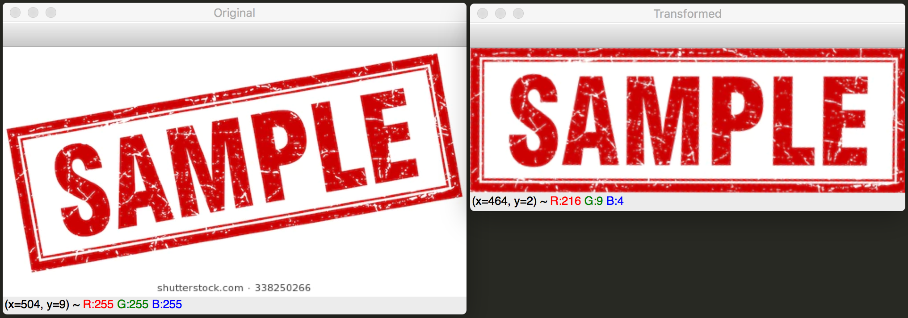

# Simple 4 Points Perspective Transformation OpenCV
First, install ```numpy``` and ```cv2```
```
pip3 install -r requirements.txt
```

How to Run:
```
python3 transform.py -image $PATH_TO_IMG -coords "[$TOP_LEFT_COORD, $TOP_RIGHT_COORD, $BOTTOM_RIGHT_COORD, $BOTTOM_LEFT_COORD]"
```
Sample:
```
python3 transform.py -image sample_images/sample1.jpg -coords "[(4, 92), (484, 7), (514, 168), (33, 254)]"
```

Result:
